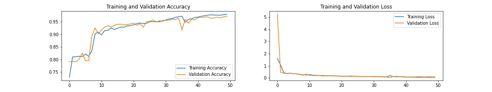
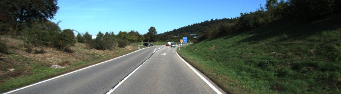
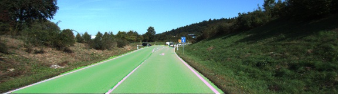
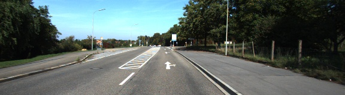
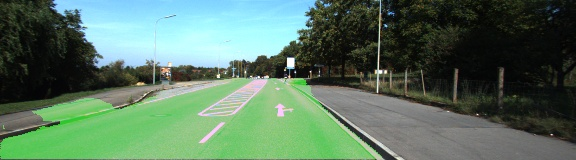
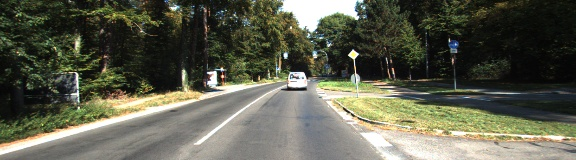

# Road-Semantic-Segmentation

## Introduction
The project aims to make a sematic segmentation between the road and the background.

## Model
The model architecture was inspired by U-Net, and you can find the paper from [here](https://arxiv.org/abs/1505.04597).

## Dataset 
The model was trained on [KITTI Road dataset](http://www.cvlibs.net/datasets/kitti/eval_road.php) from [here](http://www.cvlibs.net/download.php?file=data_road.zip).

## Performance
After 50 epochs, the accuracy achieved about 97.2%

 
  Performance.

## Result 

 

 

 

 

 

 

